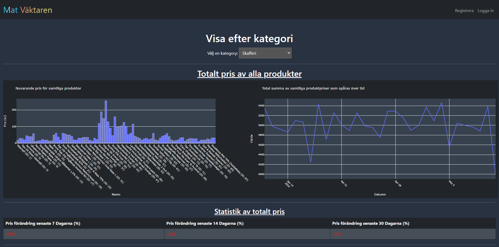

Stre4K & JakobHolger WebScraper
==============================
## Website

You can access the website [here](https://matpris-vaktaren.mangopebble-6ebcdb4f.swedencentral.azurecontainerapps.io/).

## Description of project
This project is a Web scraper based in Python to gain insight into the change in price for food sold in retail. It is not finished and still work in progress. Currently uses simulated data. Project consists of a flask web application that serves HTML pages with content from a database and an external web scraper based in Python to fetch data from external APIs. For this project we are using Microsofts SQL Server in the cloud (Azure) for our database. To set this project up you will need to create your own database locally or in the cloud and set up the SQL credentials in a config file in the src folder and the webscraper folder. 

## Screenshots

## Main landing page


## Products page


## Category page


## Specific product page


## How to use with Docker
1. Clone the repository
```
git clone https://github.com/jakobholger/MatVaktaren.git
```
2. Navigate to the cloned directory
```
cd WebscrapeMat
```
3. Create an SQL server and Database locally or in the cloud and connect to the server using the credentials which are placed inside a config.py file. Please consider another method like environment due to safety issues.

4. Navigate to the src folder
```
cd src
```
5. Build Docker image from the dockerfile located in src
```
docker build -t <name-of-choice> .
```
6. Run image
```
docker run -p 3001:3001 <name-of-choice>
```

## How to use

1. Clone the repository
```
git clone https://github.com/jakobholger/MatVaktaren.git
```
2. Navigate to the cloned directory
```
cd WebscrapeMat
```
3. Create an SQL server and Database locally or in the cloud and connect to the server using the credentials which are placed inside a config.py file. Please consider another method like environment due to safety issues.
   
4. Initialise the virtual environment
```
python3 -m venv venv
```
5. Activate the virtual environment
MACOS
```
source venv/bin/activate
```
WINDOWS
```
venv\Scripts\activate.bat
```
6. Install requirements
```
pip install -r requirements.txt
```
7. Run the program
```
#python3 main.py
flask --app app.py run
```


## Exit the program
```
to exit press CTRL + C
```

## To leave virtual environment
```
deactivate
```
