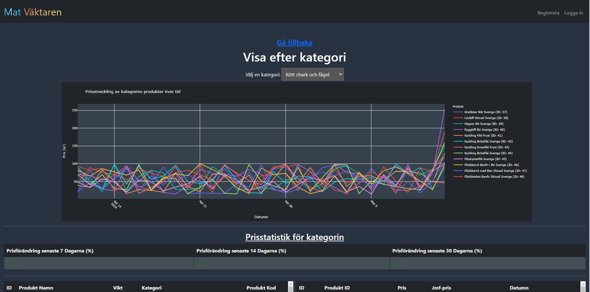
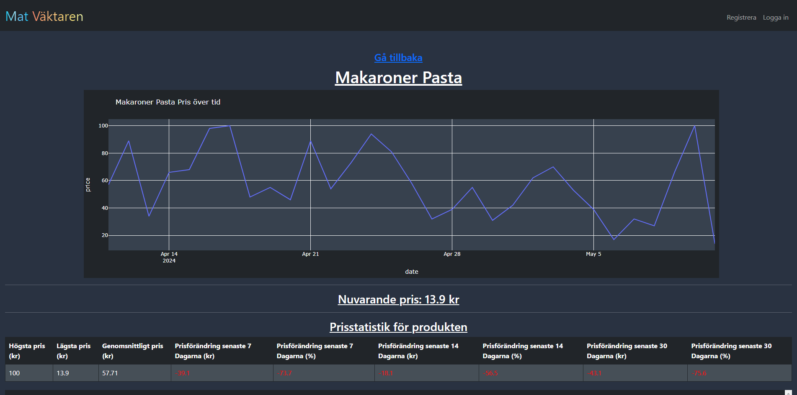

Stre4K & JakobHolger WebScraper
==============================

## Description of project
This project is a WebScraper based in Python to gain insight into the change in price for food sold in retail. It is not finished and still work in progress. Currently uses simulated data.

## Screenshots

## Main landing page


## Products page


## Category page


## Specific product page


## How to use with Docker
1. Clone the repository
```
git clone https://github.com/jakobholger/MatVaktaren.git
```
2. Navigate to the cloned directory
```
cd WebscrapeMat
```
3. Navigate to the src folder
```
cd src
```
4. Build Docker image from the dockerfile located in src
```
docker build -t <name-of-choice> .
```
5. Run image
```
docker run -p 3001:3001 <name-of-choice>
```

## How to use

1. Clone the repository
```
git clone https://github.com/jakobholger/MatVaktaren.git
```
2. Navigate to the cloned directory
```
cd WebscrapeMat
```
3. Initialise the virtual environment
```
python3 -m venv venv
```
4. Activate the virtual environment
MACOS
```
source venv/bin/activate
```
WINDOWS
```
venv\Scripts\activate.bat
```
5. Install requirements
```
pip install -r requirements.txt
```
6. Run the program
```
#python3 main.py
flask --app app.py run
```


## Exit the program
```
to exit press CTRL + C
```

## To leave virtual environment
```
deactivate
```
